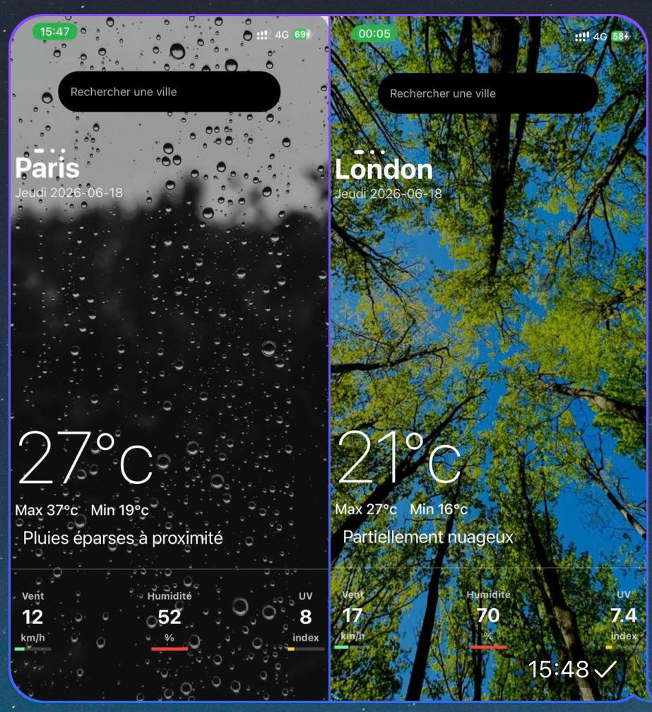

# Mobile Weather App



Une application mobile météo construite avec Expo et React Native. Elle permet de rechercher la météo d'une ville, d'afficher un aperçu sur 5 jours et de naviguer entre les jours avec un ScrollView horizontal.

## Fonctionnalités

- Recherche de ville en temps réel
- Affichage des prévisions sur 5 jours
- Images de fond dynamiques selon le type de temps
- Détails météo : température, vent, humidité, UV
- Mise à jour par glisser pour actualiser

## Architecture du projet

- `App.js` : point d'entrée de l'application
- `src/screens/HomeScreen.js` : écran principal avec l'affichage des prévisions
- `src/components/SearchInput.js` : composant de saisie de ville
- `src/api/weatherApi.js` : couche d'appel à l'API météo
- `src/utils/getImageForWeather.js` : utilitaire de sélection d'image selon la condition météo
- `assets/` : images et ressources utilisées par l'application

## Installation

1. Cloner le dépôt
   ```bash
   git clone <url-du-depot>
   cd mobile-weather-app
   ```
2. Installer les dépendances
   ```bash
   npm install
   ```

## Configuration

L'application utilise l'API WeatherAPI. Ajoutez une clé API dans votre environnement Expo :

```bash
export EXPO_PUBLIC_WEATHER_API_KEY=your_weatherapi_key
```

Pour un projet Expo local, vous pouvez également ajouter cette variable dans un fichier `.env` ou dans la configuration d'Expo.

## Lancer l'application

- Pour lancer Expo :
  ```bash
  npm start
  ```
- Pour Android :
  ```bash
  npm run android
  ```
- Pour iOS :
  ```bash
  npm run ios
  ```
- Pour le web :
  ```bash
  npm run web
  ```

## Détails techniques

- API météo : `https://api.weatherapi.com/v1/forecast.json`
- Requête utilisée : `days=5&lang=fr`
- La valeur `EXPO_PUBLIC_WEATHER_API_KEY` est récupérée via `process.env` in `src/api/weatherApi.js`
- Le composant `HomeScreen` gère la logique de chargement, le rafraîchissement et l'affichage des prévisions.

## Dépendances principales

- `expo`
- `react`
- `react-native`
- `expo-font`
- `expo-status-bar`
- `react-native-safe-area-context`
- `react-native-svg`
- `react-native-svg-transformer`
- `lodash`

## Améliorations possibles

- Ajouter la gestion des erreurs et afficher un message utilisateur en cas de ville inconnue
- Ajouter un historique des recherches
- Afficher des prévisions horaires
- Supporter la géolocalisation pour la ville actuelle

## Contribution

Toute amélioration est la bienvenue. N'hésitez pas à ouvrir une issue ou une pull request.
